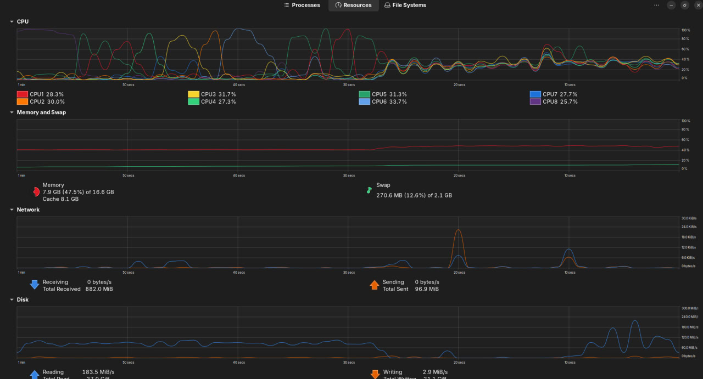

# 📊 TP02 -- Working with Large CSV Files (6GB+) in Python

## 📌 Project Overview

This project demonstrates how to efficiently process large CSV files
(\>5GB) using different Big Data techniques in Python.

Dataset used in this experiment:

-   **File name:** `big_5gb.csv`
-   **File size:** 6.00 GB

The objective is to compare performance and storage efficiency using
three different approaches.

------------------------------------------------------------------------

## 🏗 Project Structure

    TP02_How_to_work_with_big_data_files/
    │
    ├── big_5gb.csv
    ├── dist/
    │   └── results.txt
    │
    ├── src/
    │   ├── pandas_chunk.py
    │   ├── dask_method.py
    │   ├── compression_method.py
    │   └── main.py
    │
    ├── cpu_performance.png
    │
    └── README.md

------------------------------------------------------------------------

## ⚙️ Technologies Used

-   Python 3.12
-   Pandas
-   Dask
-   gzip

------------------------------------------------------------------------

## 🚀 Methods Implemented

### 1️⃣ Pandas Chunking

Reads the large CSV file in smaller partitions using:

pd.read_csv(file, chunksize=100000)

✔ Reduces memory usage\
✔ Stable\
❌ Sequential processing (slower)

------------------------------------------------------------------------

### 2️⃣ Dask

Uses parallel processing to improve performance:

dd.read_csv(file)

✔ Fastest method\
✔ Designed for large datasets\
✔ Scalable

------------------------------------------------------------------------

### 3️⃣ Compression (gzip)

-   Original size: **6.00 GB**
-   Compressed size: **1.39 GB**
-   Storage reduction: \~77%

✔ Excellent storage optimization\
❌ Slower read time due to decompression

------------------------------------------------------------------------

## 📊 Experimental Results

  Method            Execution Time (seconds)   File Size (GB)
  ----------------- -------------------------- ----------------
  Pandas Chunk      70.70 s                    6.00 GB
  Dask              50.70 s                    6.00 GB
  Compressed Read   94.39 s                    1.39 GB

------------------------------------------------------------------------

## 📈 Performance Analysis

-   **Fastest Method:** Dask (50.70 seconds)
-   **Best Storage Optimization:** Compression (77% reduction)
-   **Balanced Approach:** Pandas chunking

Dask performed better due to parallel computation, while compression
significantly reduced disk usage at the cost of increased processing
time.

------------------------------------------------------------------------
## CPU Performance Visualization

The following chart compares CPU execution time between the three methods:

Observations:
- Dask achieved the fastest execution time.
- Pandas chunking performed moderately.
- Compressed reading required more CPU time due to decompression.

------------------------------------------------------------------------

## 🧠 Key Learnings

-   Large CSV files cannot be safely loaded entirely into memory.
-   Chunking improves memory management.
-   Parallel processing significantly improves performance.
-   Compression reduces storage but increases CPU usage.

------------------------------------------------------------------------

## ▶️ How to Run

Activate virtual environment:

source .venv/bin/activate

Install dependencies:

pip install pandas dask pyarrow

Run the project:

python src/main.py

------------------------------------------------------------------------

## 🎯 Conclusion

This TP demonstrates practical techniques for handling large-scale data
efficiently using Python.

-   Use **Dask** for performance-critical workloads.
-   Use **Compression** for storage optimization.
-   Use **Pandas chunking** for controlled memory usage.
